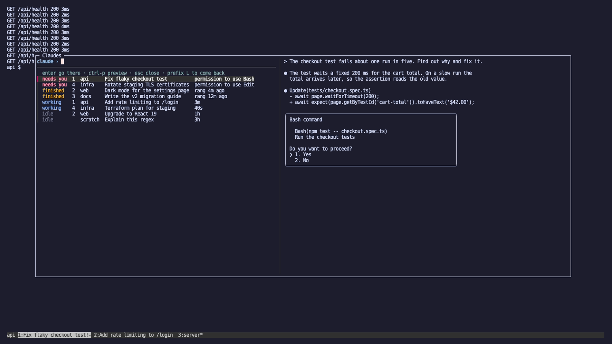
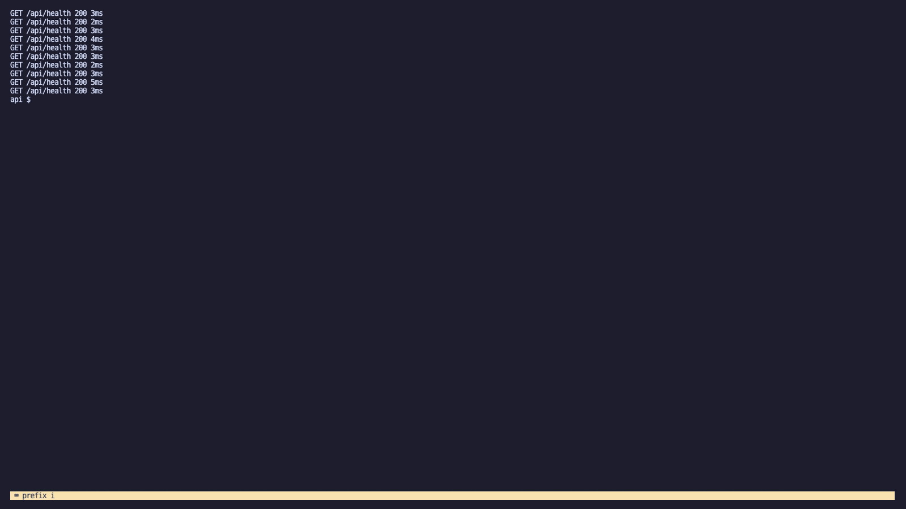
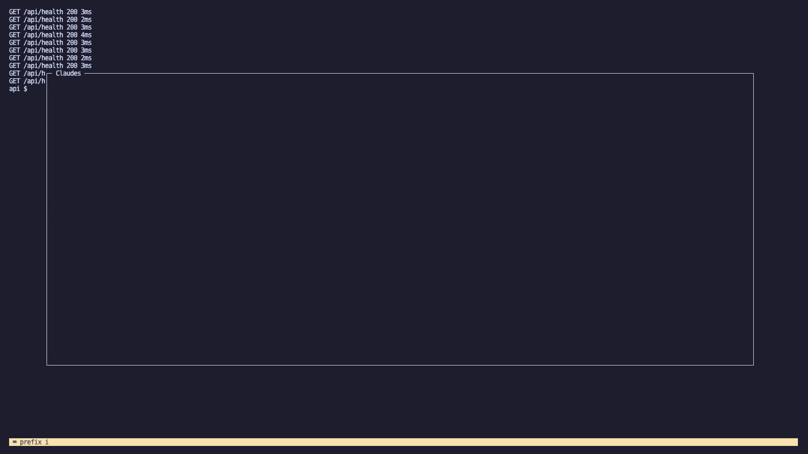
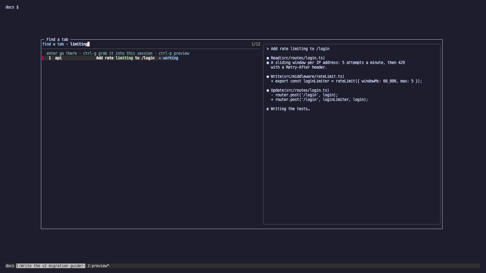
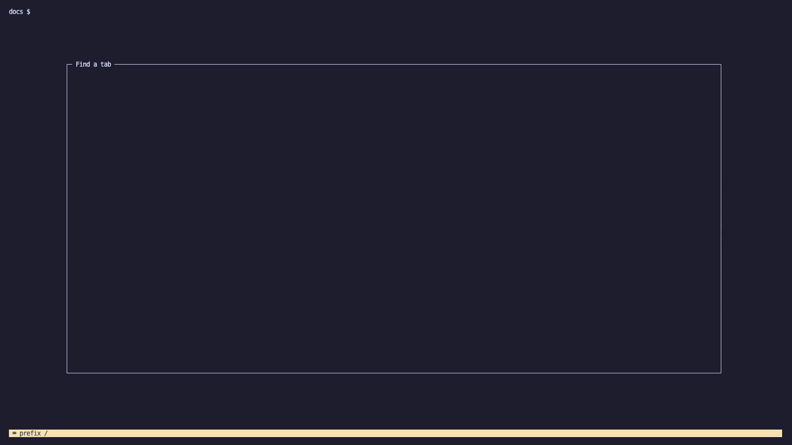
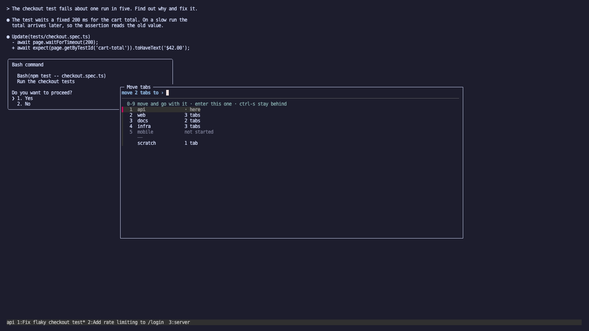
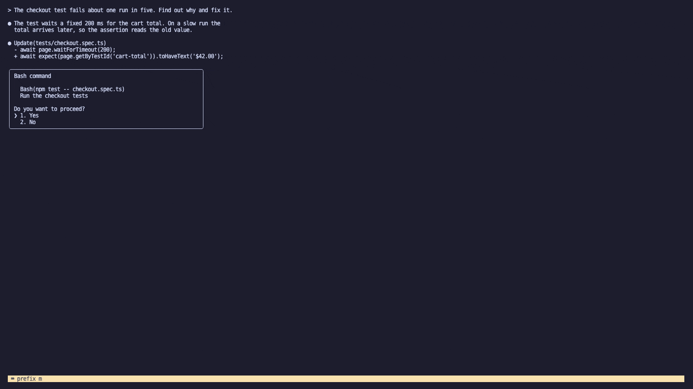
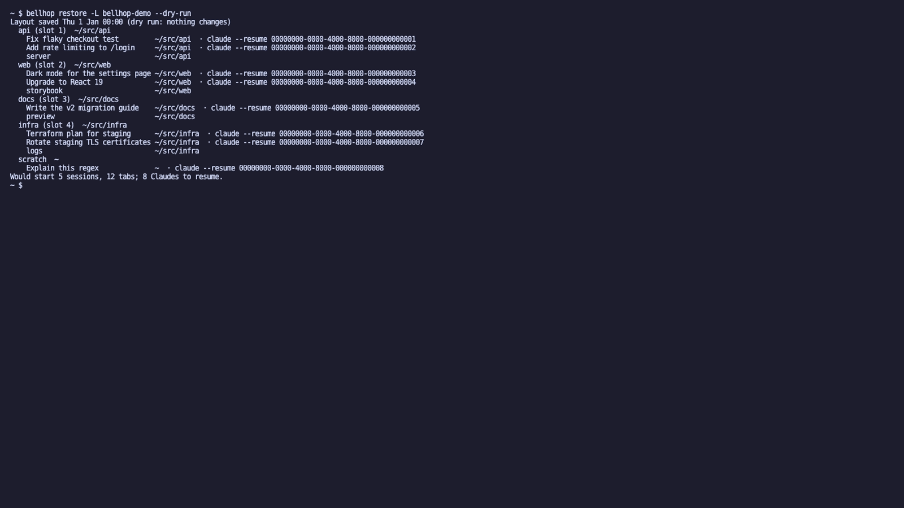

# tmux-bellhop
**Answers the bell.** See which Claude Code session needs you, find any tab, move tabs between sessions, and get them back after a reboot, in the tmux you already run.


- **Inbox** · `prefix i` · every Claude Code pane on the server, the one waiting on you first, with a live preview. Enter goes there.
- **Find** · `prefix /` · any tab in any session, by tab name or conversation title. Enter goes there; `ctrl-g` pulls it into this session.
- **Move** · `prefix m` · mark tabs, press a session's number: they move there and you go with them.
- **Restore** · `bellhop restore` · after a reboot your sessions and tabs come back, with `claude --resume <id>` typed but not run.

`set -g @plugin 'Adder-Analytics/tmux-bellhop'` · macOS & Linux · tmux ≥ 3.3 · fzf ≥ 0.42 · MIT · [](https://github.com/Adder-Analytics/tmux-bellhop/actions/workflows/ci.yml)

## Why

You run many Claude Code sessions at once, one per tmux tab, and the one that needs you is rarely the one on screen. Its bell rings in a tab you aren't looking at, and after a reboot nobody remembers which sessions, tabs, folders and conversations there were. tmux-bellhop adds three fzf popups and a restore command to the tmux you already run, with no new session model, sidebar, daemon, database or network, and it never launches or wraps Claude Code.

## Install

Requirements: tmux ≥ 3.3 · fzf ≥ 0.42 · bash ≥ 3.2 (stock macOS `/bin/bash` works) · a POSIX awk (BSD, mawk or gawk) · jq, needed only for `bellhop hook install`. Claude Code is optional. Python ≥ 3.9 is needed only to run the tests.

- macOS: `brew install tmux fzf jq`.
- Ubuntu 24.04 / Debian 13: `sudo apt install tmux fzf jq`.
- Debian 12: tmux is fine, but apt's fzf 0.38 is too old; use the fzf release binary.
- Ubuntu 22.04: tmux 3.2a and fzf 0.29 are too old.
- Fedora: `dnf install tmux fzf jq`. Arch: `pacman -S tmux fzf jq`.
- WSL: works as Linux, untested.

`prefix` is tmux's prefix key, `C-b` unless you changed it.

**A. With TPM**

```
# ~/.tmux.conf, above the `run '~/.tmux/plugins/tpm/tpm'` line
set -g @plugin 'Adder-Analytics/tmux-bellhop'
```

Press `prefix I`.

**You should now see:** `prefix /` opens "Find a tab" listing every tab. `prefix ?` lists three `bellhop:` keys.

To pin a version: `set -g @plugin 'Adder-Analytics/tmux-bellhop#v0.9.0'`.

**B. By hand**

```
git clone https://github.com/Adder-Analytics/tmux-bellhop ~/.tmux/plugins/tmux-bellhop
# at the END of ~/.tmux.conf:
run-shell ~/.tmux/plugins/tmux-bellhop/bellhop.tmux
tmux source-file ~/.tmux.conf
```

**You should now see:** the same as A.

**C. Optional steps (both paths)**

```
B="$(tmux show -gqv @bellhop-root)/bin/bellhop"   # works wherever TPM put the plugin
"$B" link            # `bellhop` on PATH (~/.local/bin); prints the PATH line for your rc if needed
"$B" hook install    # Claude Code hook: shows a diff, asks y/N
"$B" doctor          # everything ok? fix lines if not
```

Every command goes through `$B`, so nothing depends on `~/.local/bin` already being on PATH (it isn't on stock macOS zsh).
- After `hook install`, **you should now see:** start `claude` in a tab, send a prompt, press `prefix i`, and the row reads `working`.
- After `doctor`, **you should now see:** every line `ok`, apart from warnings you chose to leave.

**What it changes on the machine:**
- The plugin folder, wherever TPM puts it (`~/.tmux/plugins/tmux-bellhop` or the XDG equivalent).
- On the running tmux server only, never in your tmux.conf:
  - up to three prefix bindings (never-clobber);
  - three global hooks `after-new-window[77]`, `window-unlinked[77]` and `session-closed[77]` running `run-shell -b "[ -x '<root>/bin/bellhop' ] && '<root>/bin/bellhop' save --from-hook || true"`. The fixed index 77 means re-sourcing replaces rather than stacks, and a user's low-index hooks are untouched. The `-x` guard means a deleted plugin never puts errors in the status line;
  - server options: `@bellhop-root`; `@bellhop-prev-<key>` (and `@bellhop-prevnote-<key>`) for each key it bound, recording what the key did before so uninstall can give it back; `@bellhop-skipped` if keys were skipped.
- It sets **no** global tmux options of yours: no prefix, monitor-bell, bell-action, status, mouse or rename format. The one exception is opt-in: `set -g @bellhop-tab-titles on` makes it set `automatic-rename-format`.
- At run time: the per-socket state files ([state paths](docs/configuration.md#state-paths)). `~/.config/bellhop/map` is written only by `map init/set/edit`.
- `bellhop link`: one symlink.
- `bellhop hook install`: five entries in `~/.claude/settings.json` (or `$CLAUDE_CONFIG_DIR/settings.json`), plus backups `settings.json.bellhop-backup-<UTCstamp>` (the newest 3 are kept).
- Nothing else: no shell rc edits, no launch agents, no PATH edits.

Upgrade with `prefix U` (TPM) or `git -C ~/.tmux/plugins/tmux-bellhop pull`. To remove it, see [Uninstall](#uninstall).

## Try it first

`git clone https://github.com/Adder-Analytics/tmux-bellhop && cd tmux-bellhop && make try` starts a throwaway demo server (`tmux -L bellhop-demo`, a temporary HOME, fictional sessions) and attaches to it: press `C-b i`, `C-b /` and `C-b m`, leave with `C-b d`, and remove it with `make try-clean`. Inside tmux the demo opens in a popup, so nothing nests and your own tmux.conf, HOME and server are never touched.

## See it



## The tools

### Inbox · prefix i


Every Claude Code pane on the server in one list: needs you, then finished, working and idle, with a preview of the pane's screen.
Use it when a bell rang somewhere, or before you pick what to look at next.

<details><summary>▶ Watch it</summary>



</details>

[Manual →](docs/inbox.md)

### Find a tab · prefix /



Every tab in every session, numbered sessions first; type part of a tab name or a conversation title.
Use it to go somewhere without remembering which session it lives in, or `ctrl-g` to pull that tab next to you.

<details><summary>▶ Watch it</summary>



</details>

[Manual →](docs/find.md)

### Move tabs · prefix m



Mark one or more tabs, then press the number of the session they belong in; a numbered session that isn't running is started for them.
Use it when a conversation turns out to belong to another project, or to split a crowded session.

<details><summary>▶ Watch it</summary>



</details>

[Manual →](docs/move.md)

### Back after a reboot · bellhop restore



Starts every saved session that isn't running, with its tabs in order on their folders, and types `claude --resume <id>` in each tab that had a Claude.
Use it once after a reboot or a tmux crash; nothing runs until you press Enter in a tab.

<details><summary>▶ Watch it</summary>


</details>

[Manual →](docs/restore.md)

## Keys

| key | tool | tmux default it replaces | option |
|---|---|---|---|
| `prefix i` | inbox | `display-message` (window info) | `@bellhop-inbox-key` |
| `prefix /` | find | `command-prompt -k -p key { list-keys -1N "%%" }` (describe key) | `@bellhop-find-key` |
| `prefix m` | move | `select-pane -m` (mark pane) | `@bellhop-move-key` |

bellhop never takes a key you bound yourself: a default key is bound only when it is unbound or still does what stock tmux does, and a skipped key is named in a message and in `bellhop doctor` (set the option to pick another key, or `''` for none). `prefix ?` lists the three keys with a `bellhop:` note, and `bellhop uninstall` gives back what they did before.

## Claude Code hook (optional)

`bellhop hook install` adds one small, guarded command to five Claude Code hook events in `~/.claude/settings.json`, after showing you the diff; it keeps each Claude's state in its tmux pane and rings the tab's bell when Claude finishes or asks for permission. Without it, find, move, save and restore work fully, and the inbox still lists Claudes by their title (working, idle, finished) but never shows "needs you". See [docs/claude-code-hook.md](docs/claude-code-hook.md).

## Numbered sessions

Move's digits, and the slot column in the inbox and find, come from an optional map, `~/.config/bellhop/map`:

```
# digit  session  folder
1  api    ~/src/api
2  web    ~/src/web
3  docs   ~/src/docs
4  infra  ~/src/infra
```

No map means your running sessions are numbered 1–9, then 0, in the order `prefix s` lists them; `bellhop map init` writes them down. See [the session map](docs/configuration.md#the-session-map).

## Screen-sharing

`ctrl-p` in the inbox and find hides the preview (and shows it again); `set -g @bellhop-preview off` starts every preview hidden. Move has no preview.

## Configuration

Set these before the `@plugin` or `run-shell` line. Tools read them at run time; only the key options, `@bellhop-autosave` and `@bellhop-tab-titles` need a reload.

| option | default | meaning |
|---|---|---|
| `@bellhop-inbox-key` / `-find-key` / `-move-key` | `i` / `/` / `m` | `''` = no binding |
| `@bellhop-move-stay-key` | `ctrl-s` | fzf key name for "move and stay behind" |
| `@bellhop-preview` | `on` | `off` starts every preview hidden (screen-sharing) |
| `@bellhop-fzf-opts` | `''` | appended to every fzf call (word-split; no quoting inside) |
| `@bellhop-autosave` | `on` | the three tmux save hooks and the hook's saves |
| `@bellhop-save-ignore` | `''` | tmux glob of session names save skips, e.g. `scratch-*` |
| `@bellhop-focus-cmd` | `''` | focus adapter for jump |
| `@bellhop-tab-titles` | `off` | `on` sets `automatic-rename-format` so a tab with a Claude title is named after it (glyph stripped); other tabs use tmux's default format |

Environment variables, the map format, focus adapters and terminal shortcuts are in [docs/configuration.md](docs/configuration.md).

## How it works

The Claude Code hook writes each Claude's state into its tmux pane's options (`@bellhop_*`) and rings the pane's bell, so tmux flags the tab. One reader, `bellhop panes`, turns a single `list-panes` call into one line per pane with the Claude's state worked out from the title glyph, the hook's state and the bell flag. The inbox, find and save all read those lines, and the popups are fzf inside `display-popup`. More in [docs/how-it-works.md](docs/how-it-works.md).

## Known limitations

- Widths count double-width CJK characters and emoji as 1 column, so such names can misalign the columns.
- State detection depends on Claude Code's title glyphs and notification text; a change there can hide a state until bellhop follows.
- One tmux server at a time: the inbox and find show the server you pressed the key on.
- Claudes on remote hosts are invisible (a remote tmux is a separate server).

## Troubleshooting

Run `bellhop doctor` first: every warning and failure comes with a fix line. The three most common fixes:
- **A key does nothing:** it was already bound, so bellhop left it alone; set `@bellhop-<tool>-key` to a free key and reload tmux.conf.
- **The inbox is empty or never says "needs you":** run `bellhop hook install`, then restart the Claude Code sessions that were already open.
- **Never "finished":** `set -g monitor-bell on`; tmux flags a tab's bell only when monitor-bell is on and you are not looking at that tab.

The rest is in [docs/troubleshooting.md](docs/troubleshooting.md).

## Uninstall

```
B="$(tmux show -gqv @bellhop-root)/bin/bellhop"   # as in step C; set it first, uninstall unsets @bellhop-root
"$B" uninstall               # hook entries out (backed up), link removed, keys + hooks off your tmux servers
# delete the @plugin line (or run-shell line) from tmux.conf, then prefix alt-u (TPM) or rm -rf the clone
rm -rf ~/.local/state/bellhop ~/.config/bellhop     # or, before the clone goes: "$B" uninstall --purge
```

`"$B"` keeps working after `uninstall` removes the `bellhop` link. Uninstall takes bellhop off the server you run it in (or the default one) and off every other server of yours (`tmux -L NAME`) that loaded the same copy; it names each one.

If the plugin folder is deleted first, nothing breaks. The settings entries and tmux hooks are guarded with `test -x … || true`, so Claude Code never shows a hook error, and `bellhop hook uninstall` can still be run from a fresh clone.

## Contributing

`make lint test` runs what CI runs: end-to-end tests (`tests/run.sh`) that drive throwaway tmux servers through a pty on macOS and Linux, never your own server or HOME. See [CONTRIBUTING.md](CONTRIBUTING.md).

## License

MIT. See [LICENSE](LICENSE).

---

Built and maintained by Adder Analytics · MIT License

Not affiliated with Anthropic. Claude and Claude Code are trademarks of Anthropic.
