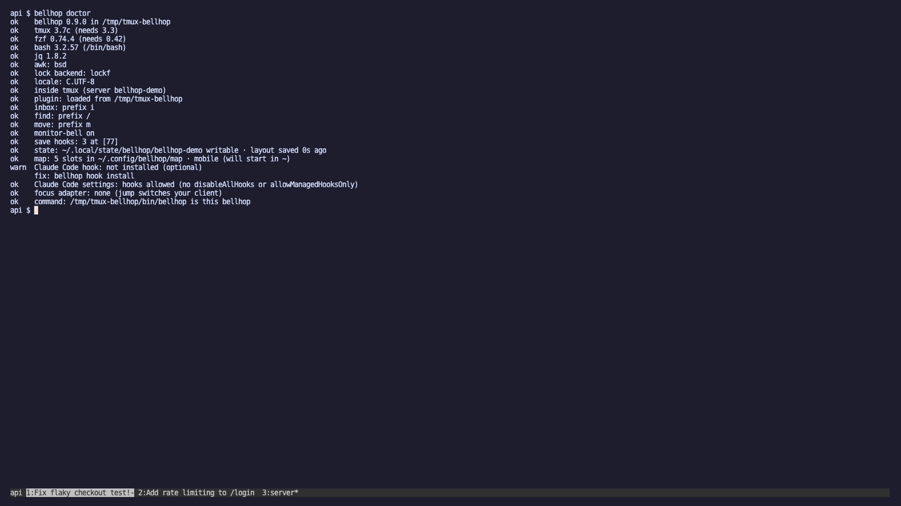

# Troubleshooting

Run `bellhop doctor` first: it checks tmux, fzf, bash, jq, awk, the locale, the plugin and its keys, the save hooks, the map and the Claude Code hook, one line each, with a fix line under every warning and failure.



The lines read `ok`, `warn`, `fail` or `skip`, for example:

```
ok    tmux 3.4 (needs 3.3)
ok    fzf 0.55.0 (needs 0.42)
warn  Claude Code hook: not installed (optional)
      fix: bellhop hook install
```

Paths are shown from `~`, so the output can go into an issue as it is. `bellhop doctor` exits 1 when a check fails. It checks the tmux server it runs in, else the default one; `bellhop doctor -L work` checks the server you start with `tmux -L work`. If `bellhop` isn't on your PATH, run it as `"$(tmux show -gqv @bellhop-root)/bin/bellhop" doctor`.

`prefix` below is tmux's prefix key, `C-b` unless you changed it.

## A key does nothing

**Why:** bellhop never takes a key you bound yourself. When `prefix i`, `prefix /` or `prefix m` already did something other than tmux's default, it was skipped, and tmux showed `bellhop: prefix m is bound to something else; set @bellhop-move-key to pick a key` when the plugin loaded. With tmux older than 3.3 no key is bound at all (`bellhop needs tmux ≥ 3.3 (you have 3.2a); keys not bound`). Or the plugin isn't loaded on this server.

**Fix:** `bellhop doctor` shows each key and why it was skipped. Pick a free key, or take the default key on purpose, then reload:

```
set -g @bellhop-move-key M     # in tmux.conf, before the plugin line
tmux source-file ~/.tmux.conf
```

Upgrade tmux if it is older than 3.3. `prefix ?` lists the keys bellhop bound, with a `bellhop:` note.

Still stuck? Open an issue with `bellhop doctor` output.

## The popup flashes and closes

**Why:** usually fzf. The popups need fzf 0.42 or newer: Debian 12's packaged fzf (0.38) and Ubuntu 22.04's (0.29) are too old. bellhop checks and says `bellhop: needs fzf ≥ 0.42 (found 0.38) · bellhop doctor` on the status line, but a message on the status line is easy to miss. Any other error inside the popup also closes it.

**Fix:** type the command in a tmux pane (`bellhop inbox`, `bellhop find` or `bellhop move`), where errors stay on the screen. Install a newer fzf from the fzf releases page if doctor says it is too old. `@bellhop-fzf-opts` with an option your fzf doesn't know also makes fzf exit at once: unset it to check.

Still stuck? Open an issue with `bellhop doctor` output.

## The inbox says no Claude Code panes

**Why:** the inbox lists panes whose title carries a Claude Code glyph, or whose Claude the hook knows. With `No Claude Code panes on this server · hook not installed: bellhop hook install`, the hook isn't installed. If it is installed, the Claudes may have started before it: Claude Code reads its hooks when a session starts. A Claude running outside tmux, or in another tmux server, is never listed.

**Fix:** `bellhop hook install`, then restart the Claude Code sessions that were open (quit and `claude --resume`). Start Claude inside a tmux pane of the server you open the inbox on.

Still stuck? Open an issue with `bellhop doctor` output.

## Never "needs you"

**Why:** only the hook knows that Claude is waiting for your permission, from its permission-prompt notification. Either the hook is missing for some events, or Claude Code isn't running it: `"disableAllHooks": true` or `"allowManagedHooksOnly": true` in the settings turns off every hook listed there.

**Fix:** `bellhop hook status` shows each event (`installed`, `missing` or `stale`) and names either setting when it is on. Run `bellhop hook install` for missing or stale events; the two settings are yours or your administrator's to change.

Still stuck? Open an issue with `bellhop doctor` output.

## Never "finished"

**Why:** finished means the tab's bell rang and you haven't looked at it since. tmux sets the bell flag only when `monitor-bell` is on (tmux's default, but some configs turn it off), and never for the tab you are looking at: a Claude that finishes in front of you shows as idle, which is right.

**Fix:**

```
set -g monitor-bell on
```

`bellhop doctor` warns when it is off. Without the hook, only something else ringing the tab's bell makes a Claude finished; see [the Claude Code hook](claude-code-hook.md).

Still stuck? Open an issue with `bellhop doctor` output.

## All tabs say "claude" or "node"

**Why:** tmux names each tab after the command running in it, and for Claude Code that is `claude`, `node` or the shell.

**Fix:** name the tabs after the conversations:

```
set -g @bellhop-tab-titles on
tmux source-file ~/.tmux.conf
```

Tabs whose pane shows a Claude title are named after it (glyph stripped); other tabs keep tmux's default names. A tab is renamed the next time its pane draws. Find matches the conversation titles either way.

Still stuck? Open an issue with `bellhop doctor` output.

## Restore says nothing saved

**Why:** `bellhop restore: nothing saved in ~/.local/state/bellhop/default/layout` means no layout for that server. Saves happen when tabs open and close and when a Claude starts or ends, so a server where nothing changed since the plugin loaded has none yet. `@bellhop-autosave off` stops saves. And each tmux server keeps its own layout: a server started with `tmux -L work` saved to `~/.local/state/bellhop/work/layout`.

**Fix:** for another server, name it: `bellhop restore -L work`. Check `bellhop doctor` for `save hooks: 3 at [77]` and the state line, which says when the layout was last saved. `bellhop save` saves by hand. `BELLHOP_STATE_DIR` and `XDG_STATE_HOME` move the folder, so they must be the same when saving and restoring.

Still stuck? Open an issue with `bellhop doctor` output.

## ctrl-s does nothing in move

**Why:** some terminals, and some ssh hops in between, treat ctrl-s as flow control ("pause output") and never pass it on.

**Fix:** pick another fzf key for "move and stay behind"; the popup's header then names it:

```
set -g @bellhop-move-stay-key ctrl-t
```

Still stuck? Open an issue with `bellhop doctor` output.

## Columns are misaligned

**Why:** the popups count characters to line up their columns, which needs a UTF-8 locale. When yours isn't UTF-8, bellhop picks `C.UTF-8` or `en_US.UTF-8` if the system has one. Double-width characters (CJK, emoji) in session or tab names still count as one column.

**Fix:** `bellhop doctor` shows the locale it uses. If it warns that no UTF-8 locale is installed, install one (`locale -a` lists them; on Debian and Ubuntu, `C.UTF-8` comes with libc). Keep double-width characters out of session and tab names.

Still stuck? Open an issue with `bellhop doctor` output.

## Remove everything by hand

**Why:** `bellhop uninstall` does all of this, but you may have deleted the plugin folder first, or want to see each piece.

**Fix:** in any tmux pane, first see which keys bellhop bound and what they did before:

```
tmux list-keys -T prefix | grep bellhop
tmux show -g | grep '^@bellhop-prev'
```

Unbind only the keys the first command lists. A key that bellhop skipped because you had bound it yourself (it is in `@bellhop-skipped`) is yours: leave it alone. For example, when it lists all three:

```
tmux unbind -T prefix i \; unbind -T prefix / \; unbind -T prefix m
```

Then take the save hooks and bellhop's server options off:

```
tmux set-hook -gu 'after-new-window[77]' \; set-hook -gu 'window-unlinked[77]' \; set-hook -gu 'session-closed[77]' \; set -gu @bellhop-root \; set -gu @bellhop-skipped
for k in i / m; do tmux set -gu "@bellhop-prev-$k" \; set -gu "@bellhop-prevnote-$k"; done
```

To give an unbound key back what it did before, press `prefix :` and enter the `bind-key …` line that `@bellhop-prev-<key>` showed for it. For tmux's defaults those are:

```
bind i display-message
bind m select-pane -m
bind / command-prompt -k -p key { list-keys -1N "%%" }
```

If you used `set -g @bellhop-tab-titles on`, also delete that line; tmux's own `automatic-rename-format` returns when the server restarts, or with `tmux set -gwu automatic-rename-format`.

Then:
- delete the `@plugin` (or `run-shell`) line from tmux.conf;
- remove the Claude Code hook entries: `bellhop hook uninstall`, from a fresh clone if the folder is gone, or delete by hand the five entries whose command contains `bellhop-hook` in `~/.claude/settings.json`; they are harmless meanwhile, because each is guarded with `test -x … || true`;
- `rm ~/.local/bin/bellhop` if you ran `bellhop link`;
- `rm -rf ~/.local/state/bellhop ~/.config/bellhop` for the saved layouts and the map.

Still stuck? Open an issue with `bellhop doctor` output.
